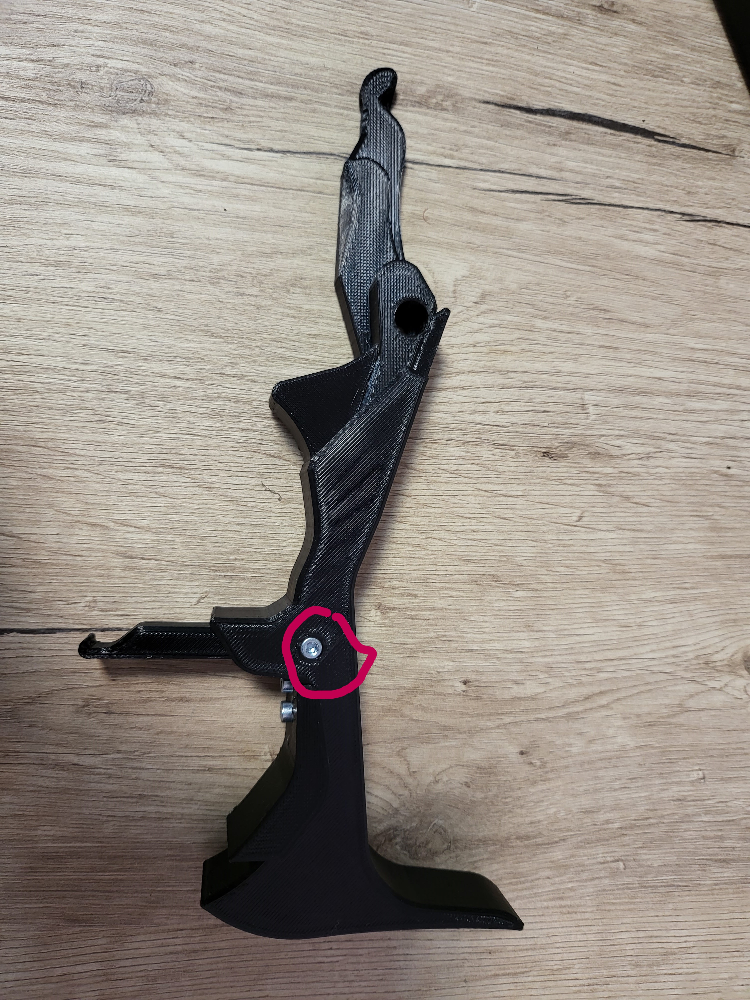
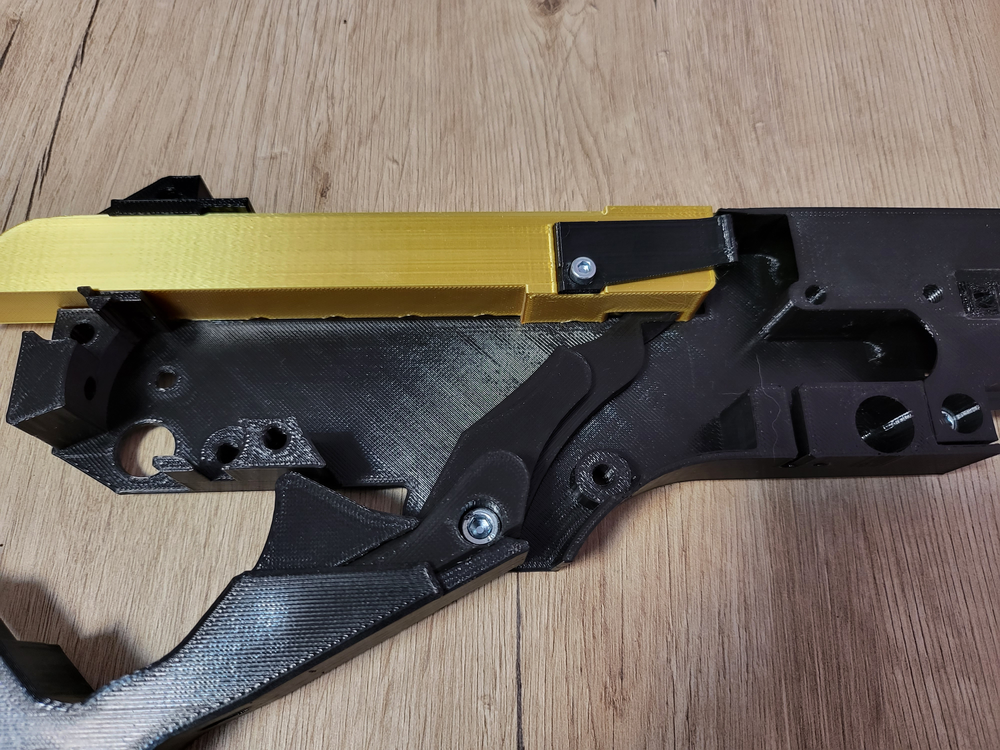
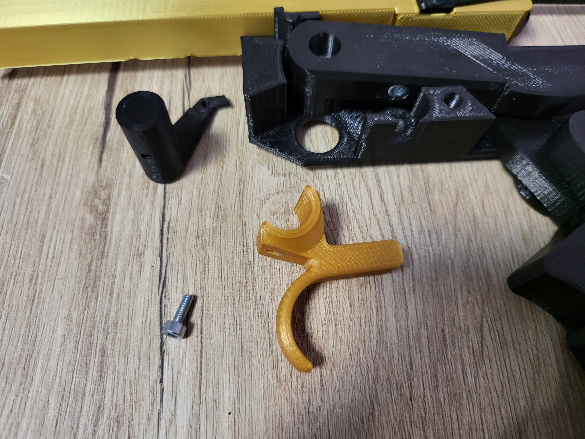

<h1 style="text-align: center;"> The DMT lever-action prop rifle and dart blaster assembly instructions </h1>

## Notes
- All screws used in the assembly process screw into plastic, do not use excessive force. You should stop tightening a screw when reaching the end and encountering more resistance. Use the images as reference to know when a screw is completely in.
- A replacement orange muzzle is included (or should be printed), don’t take this toy in public without the orange muzzle.
- Two allen keys are required (2.5 mm and 4 mm ), if you have longer ones they will help with the screws that are in harder to reach areas.
- Skip to the last chapter for final assembly if you are receiving this item partly assembled.

    

## Chapter 1: the "receiver"

### Step 1: extractor and bolt
- 1 x M3x8 mm screw

    
    

### Step 2: bolt, ejector, frame
- 2 x M3x8 mm screws

    
    
    

### Step 3: frame and adapter
- 2 x M5x10 mm screws

    
    

    
    

### Step 4: lever lock
- 2 x M3x8 mm screws

    
    

### Step 5: lever extension
- 1 x M3x20 mm screws

    
    

### Step 6: lever assembly
- 1 x M3x8 mm screws
- 1 x 5x10 mm compression spring (or similar)
- These are mechanical parts and should move freely. Each screw should be tightened until the parts stop moving and untightened about half a turn so they can spin around the screw.

    
    
    

### Step 7: lever and receiver
- 1 x M5x10 mm screws
- These are mechanical parts and should move freely. Each screw should be tightened until the parts stop moving and untightened about half a turn so they can spin around the screw.

    
    

### Step 8: elevator assembly
- 1 x M3x8 mm screws
- 1 x 5x10 mm compression spring (or similar)
- These are mechanical parts and should move freely. Each screw should be tightened until the parts stop moving and untightened about half a turn so they can spin around the screw.

    
    
    

### Step 9: receiver and elevator
- 1 x M5x10 mm screws
- These are mechanical parts and should move freely. Each screw should be tightened until the parts stop moving and untightened about half a turn so they can spin around the screw.

    
    

### Step 10: spring and follower
- 3 x M3x8 mm screws
- This step requires a keycard reel or similar, in the example bellow the string was replaced with fishing wire to reduce friction but a regular unmodified reel may work fine

    
    
    

    
    

### Step 11: trigger
- 1 x M3x8 mm screws

    
    
    

### Step 12: receiver lid
- 3 x M5x10 mm screws

    
    

