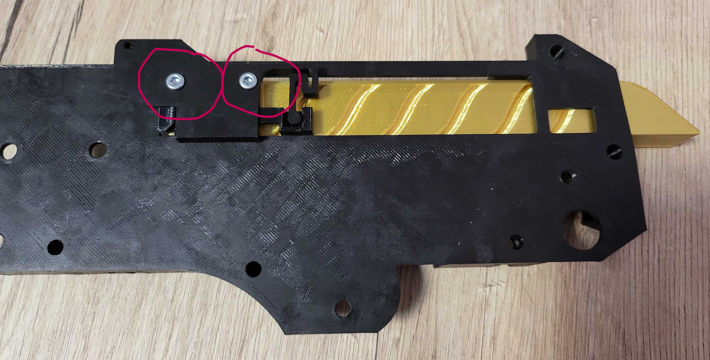
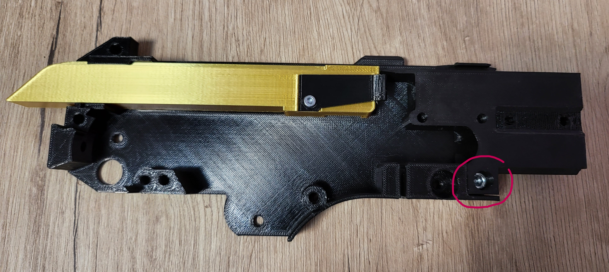
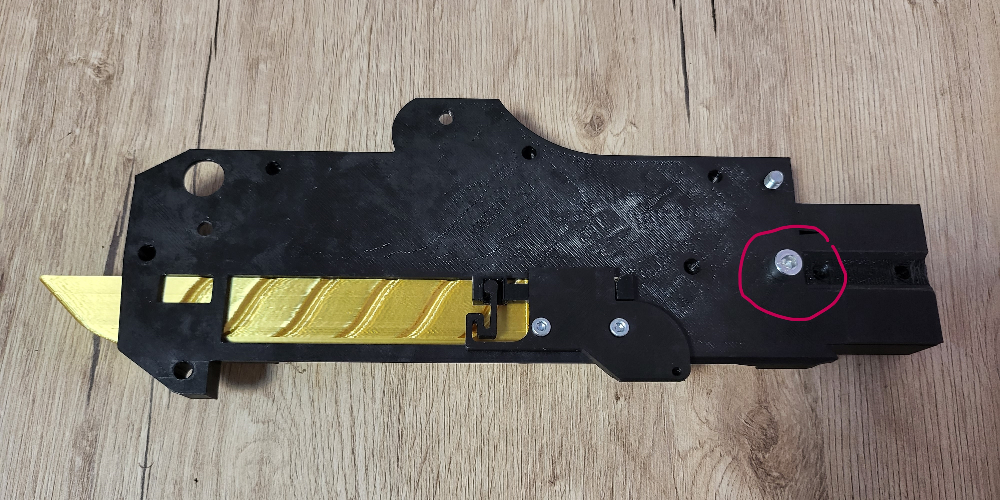

<h1 style="text-align: center;"> The DMT lever-action prop rifle and dart blaster assembly instructions </h1>

## Notes
- All screws used in the assembly process screw into plastic, do not use excessive force. You should stop tightening a screw when reaching the end and encountering more resistance. Use the images as reference to know when a screw is completely in.
- A replacement orange muzzle is included (or should be printed), don’t take this toy in public without the orange muzzle.
- Two allen keys are required (2.5 mm and 4 mm ), if you have longer ones they will help with the screws that are in harder to reach areas.
- Skip to the last chapter for final assembly if you are receiving this item partly assembled.

    

## Chapter 1: the "receiver"

### Step 1: extractor and bolt
- 1 x M3x8 mm screw

    
    

### Step 2: bolt, ejector, frame
- 2 x M3x8 mm screws

    
    
    

### Step 3: frame and adapter
- 2 x M5x10 mm screws

    
    
    
    

